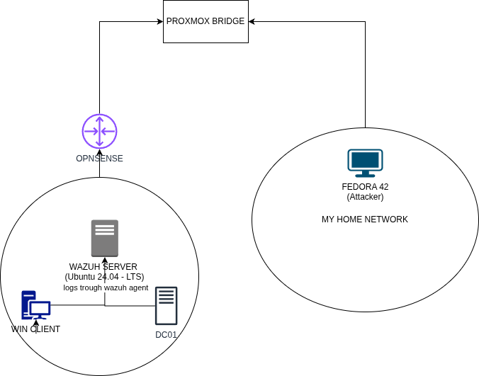

## Chapter 2. Background

### 2.1 The Problems of a Modern SOC

Modern SOC operations are shaped by three simultaneous pressures: volume, heterogeneity, and response-time constraints. Volume refers not only to the number of incoming alerts, but to the amount of contextual logs required to manage each alert. Heterogeneity refers to the coexistence of endpoint events, identity activity, network traces, and platform-specific log schemas, each with different structure. Response-time constraints are imposed by internal service-level objectives and by the practical expectation that suspicious activity must be investigated before lateral movement or persistence becomes harder to contain.

Within this environment, the L1 analyst role is operationally critical and structurally overloaded. The analyst is expected to triage quickly, collect sufficient evidence, avoid premature escalation, and maintain consistency across long shifts. In practice, this means repeatedly executing similar investigative micro-workflows: check alert context, verify whether it happened before, correlate with related events, identify plausible benign explanations, and only then formulate an assessment. The repetitive nature of this loop does not make it intellectually stimulating. On the contrary, it increases cognitive fatigue and raises the risk of inconsistent decisions.

Alert fatigue therefore emerges as both a human and system-design problem. It is human because attention and short-term reasoning are finite resources. It is architectural because deterministic pipelines degrade when data sources mutate: field names change, detection logic drifts, and procedural rules require continuous maintenance. As the number of integrations grows, maintenance cost tends to increase faster than linearly, while investigative quality becomes increasingly dependent on tacit analyst knowledge.

For this reason, the thesis frames automation as support for investigative reasoning, not as replacement of analyst judgment. The intended system must preserve an explicit evidence chain, remain adaptable to source-specific schema differences, and provide outputs that can be audited and discussed in operational terms.

### 2.2 Wazuh: Platform Role, Components, and Investigative Value

Wazuh is an open-source SIEM widely used in the industry. A SIEM is not a single service but a central platform that ingests endpoint data, network logs, and signals from third-party tools (for example XDR and NDR solutions). Wazuh is composed of three main components: the manager, the indexer, and the dashboard.
The Manager functions as the core coordination component: it collects logs from agents installed on endpoints and servers, decodes them, and processes them using built-in and custom rules.
The Indexer, based on OpenSearch (an open-source fork of Elasticsearch), allows analysts to query large volumes of events with custom filters to retrieve only relevant data.
The Dashboard is the GUI component that supports data visualization in a variety of forms, including data tables, graphs, and custom views.

At infrastructure level, two interfaces are relevant and must be clearly separated. The Wazuh Manager API (port 55000) is oriented to management operations and is not the analytical query surface used by the agent. The investigative query surface is the Wazuh Indexer (OpenSearch, port 9200), where events and alerts are indexed and searchable through OpenSearch DSL.

From a data perspective, Wazuh provides two practically distinct index families. The index pattern `wazuh-archives-*` is the primary analytical space because it contains broad event telemetry, including the contextual traces needed for enrichment and correlation. The index pattern `wazuh-alerts-*` is used only when the workflow explicitly needs fired-alert documents. This choice allows the agent to move from alert-level visibility to event-level reconstruction without changing platform.

Wazuh also introduces a key technical challenge: decoder-dependent field variability. Different log sources expose equivalent concepts through different paths, such as source IP or username fields represented under distinct schemas. Querying the wrong field often yields empty results without explicit errors, which can be misinterpreted as benign absence of activity. The implementation addresses this by using decoder-specific analysis skills rather than one generic skill. In this way, each investigative primitive is aligned with the field semantics of the originating source, and missing fields are explicitly signaled through note fields rather than silently ignored.

Operationally, this makes Wazuh suitable for investigation automation: it provides real security telemetry, supports structured query execution, and exposes enough schema complexity to justify the design decisions on specialization, traceability, and layered query handling.

### 2.3 Claude Agent as the Reasoning Layer

The reasoning layer in this system is implemented with Anthropic Claude through the Python SDK, not as a generic text generator but as a tool-using analytical agent. This distinction is central. The model is not asked to hallucinate ground truth from prompts; it is asked to decide which operations to run, interpret returned evidence, and produce structured intermediate and final artifacts.

In the implemented pipeline, Claude is instantiated across explicit roles. The Analyst role performs investigative exploration and tool invocation. The Evaluator role reads the analyst artifact and produces a verdict-oriented assessment with confidence. The Formatter role transforms these artifacts into a schema-constrained incident report through forced tool output. A Reflector role is added to update long-term memory policy after verdicts are known.

This role decomposition has two advantages. First, it reduces objective mixing, where one prompt tries to investigate, judge, and format simultaneously. Second, it improves auditability because each role leaves a separate artifact that can be reviewed independently. The approach therefore treats Claude as a bounded decision engine, rather than as an opaque monolithic assistant.

Another relevant point is control of output structure. Free-form completions are useful for exploratory analysis but weak for strict downstream processing. The architecture mitigates this by combining natural-language reasoning with schema-bound tool outputs where needed, especially in report generation.

### 2.4 LangGraph in Detail: Why a State Graph Instead of a Linear Script

LangGraph is the orchestration framework used to encode the agent workflow as an explicit state machine. In this context, a graph is not a visual convenience but the runtime that defines node responsibilities, state transitions, and allowable execution paths.

The project uses LangGraph to define a typed pipeline state and a controlled transition chain. The graph is composed of these nodes: START -> Analyst -> Evaluator -> Formatter -> Reflector -> END. Because transitions are explicit, adding or removing a node is a design decision visible at architecture level, easy to implement and document.

This matters for three reasons. First, explainability: each node corresponds to a single conceptual function, which can be documented and reviewed. Second, testability: node behavior can be validated independently with mocked dependencies and deterministic state inputs. Third, maintainability: logic can be localized, for example keeping analytical knowledge inside the Analyst rather than scattering it across components.

LangGraph also enforces disciplined state handling. Instead of passing loosely structured prompt context only, the pipeline carries a defined state object that accumulates alert input, intermediate artifacts, and final report content. This supports reproducibility because the same state transition sequence can be replayed and inspected, and it supports observability because each stage can emit structured logs tied to the same run identifier.

In summary, LangGraph was selected not for novelty but for architectural clarity. It provides a concrete execution model that aligns with the thesis requirements of auditability, modularity, and methodological transparency.

### 2.5 ChromaDB: Why It Was Chosen and What It Does

ChromaDB is the persistent memory layer used to make the agent improve over time through query reuse, instead of relying only on static templates or one-shot reasoning. In this architecture, it stores investigative queries that have practical analytical value, together with metadata that describes where and when the query is applicable.

The main reason for this choice is architectural simplicity with operational utility. ChromaDB runs locally, does not require complex external infrastructure, and supports semantic retrieval over text embeddings. This makes it suitable for a thesis environment where reproducibility, transparency, and low operational overhead are important constraints.

In the implemented workflow, ChromaDB is not a replacement for hand-written templates/skills. It is an additive memory mechanism. The template store still provides deterministic primitives, while ChromaDB retains queries earned at runtime from previous investigations. This hybrid approach balances reliability and adaptability.

At functional level, ChromaDB supports four core operations in the project:
1. Query storage: save crafted or modified queries with metadata such as security component, input type, goal, and timestamps.
2. Semantic retrieval: search for past queries similar to the current investigative goal using embedded text.
3. Context filtering: apply metadata constraints before semantic retrieval (for example security component and input type) to avoid irrelevant matches.
4. Performance tracking: update usage counters (times used and times successful) so reuse decisions can be evidence-driven.

The practical effect is reduced effort in recurring scenarios and a more consistent investigative baseline across runs.

### 2.6 Explainability and Auditability

Explainability in this project is not treated as a business narrative. It is built into the architecture through typed interfaces, a fixed report schema, and structured execution logging. Every pipeline run produces human-readable traces that capture what was called, what was retrieved, and how outcomes were judged.

Auditability is further reinforced by preserving full analyst and evaluator artifacts in the final report payload, together with a run identifier stamped across structured logs. This design enables later review, metric extraction, and future improvements without changing core runtime behavior.

### 2.7 Technology Stack Used in the Implementation

The following technologies constitute the effective stack used by the implemented system. Each choice is tied to a concrete architectural need rather than convenience.

| Technology | Role in the system | Why this choice fits the thesis constraints |
|------------|--------------------|---------------------------------------------|
| Python 3.12 | Primary implementation language for skills, agent nodes, orchestration, and tests | Enables clear type annotations and rapid iteration |
| Anthropic SDK (anthropic) | Claude-based reasoning layer for Analyst, Evaluator, Formatter, Reflector, and query-retrieval/crafting decisions | Enables role-separated agent behavior with reliable tool-calling and explicit integration boundaries |
| LangGraph (langgraph) | Typed state-graph orchestration of the full multi-agent workflow | Encodes transitions as explicit architecture, improving explainability, testability, and controlled extensibility |
| OpenSearch Python client (`opensearch-py`) | Query execution against Wazuh Indexer (port 9200) using OpenSearch DSL | Provides direct and reliable analytical access to indexed security events |
| Wazuh Indexer (OpenSearch backend) | Security telemetry and alert/event retrieval substrate | Already present in infrastructure and operationally aligned with SOC investigative workflows |
| ChromaDB (`chromadb`) | Persistent vector memory for reusable query patterns and semantic retrieval | Enables runtime knowledge accumulation without model retraining |
| Python JSON Logger (`python-json-logger`) | Structured JSON logging for run-level observability | Produces machine-readable traces needed for later evaluation metrics and auditability |
| Python Dotenv (`python-dotenv`) | Environment variable loading for credentials and runtime configuration | Keeps sensitive values external to code and supports reproducible local execution |
| Pytest (`pytest`) | Automated verification of skills, clients, pipeline behavior, and regression safety | Ensures implementation claims are backed by repeatable tests across components |

In addition to libraries, two infrastructural elements are part of the practical stack: a Windows Domain Controller and a Windows client instrumented with Wazuh agents. These hosts generate the heterogeneous security events that motivate decoder-specific skill design and provide realistic telemetry for evaluation. The environment also includes syslog telemetry from an OPNsense router to support investigation of network traces.

### 2.8 IT Infrastructure Overview

Below is a schema of the IT infrastructure:

