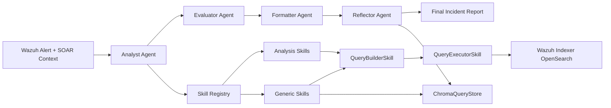
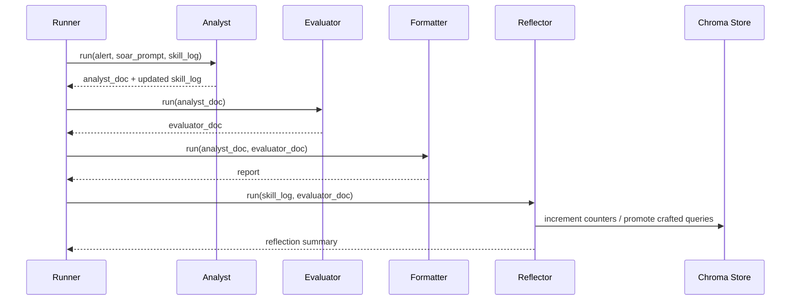
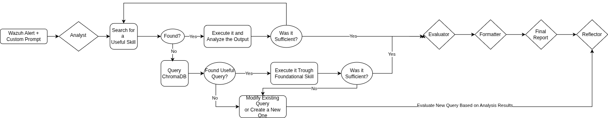

## Chapter 4. System Design and Architecture

### 4.1 Architecture Overview

This chapter presents the concrete architecture of the SOC L1 agent as implemented in code. The design objective is not  to automate alert handling, but to produce an investigation pipeline. For this reason, the system is decomposed into layers and role-specific agents, each with a specific responsibility.

At runtime, the pipeline starts from a raw Wazuh alert plus optional SOAR context and terminates in a fixed-schema incident report. The main execution path is modeled as a LangGraph state machine, while all data enrichment is delegated to skill modules that rely on foundational query services.



The four core design goals are:
1. Deterministic orchestration with explicit state transitions.
2. Strict interface contracts between components.
3. Decoder-aware enrichment to avoid silent field mismatches.
4. Progressive self-improvement through controlled memory.

### 4.2 End-to-End State Model and LangGraph Orchestration

The orchestration backbone is implemented in `agent/graph.py` through a typed `PipelineState`. This state object is intentionally minimal: it stores alert input, intermediate documents, final report, skill execution log, and reflector output.

```python
class PipelineState(TypedDict, total=False):
    run_id: str
    alert: dict[str, Any]
    soar_prompt: str
    analyst_doc: str
    evaluator_doc: str
    report: IncidentReport
    skill_log: list[SkillExecutionRecord]
    reflection: dict[str, Any]
```

Graph assembly is explicit and linear. The reflector node is optional, but in the production path it is appended after formatting so it can read the final verdict before deciding what to persist.

```python
graph.add_edge(START, "analyst")
graph.add_edge("analyst", "evaluator")
graph.add_edge("evaluator", "formatter")
graph.add_edge("formatter", "reflector")
graph.add_edge("reflector", END)
```

This explicit graph provides two benefits crucial for a thesis artifact:
1. Execution semantics are visible in architecture diagrams and code.
2. Behavior changes require structural edits, not hidden prompt side effects.

A concise sequence view of one run is shown below.



### 4.3 Skill Contract and Execution Lifecycle

All skills inherit from the same abstract base in `skills/base.py`. The contract separates private analytical logic (`_run`) from public runtime concerns (`execute`). This prevents duplicated timing/error code and ensures uniform result envelopes.

```python
class Skill(ABC):
    name: str
    description: str
    input_type: InputType
    is_generic: bool = False
    tool_input_schema: dict[str, Any] | None = None

    @abstractmethod
    def _run(self, value: str, context: dict[str, Any]) -> SkillResult:
        ...

    def execute(self, value: str, context: dict[str, Any] | None = None) -> SkillResult:
        # wraps _run with timing + top-level exception guard
```

The `SkillResult` structure is shared by all skills and explicitly stores both machine-usable payload and analyst-readable summary.

```python
@dataclass
class SkillResult:
    data: dict[str, Any]
    summary: str
    success: bool
    source: str = ""
    duration_ms: float = 0.0
```

Execution lifecycle of one skill call:
1. Analyst issues tool invocation.
2. Skill receives `value` plus shared `context`.
3. `_run` executes domain logic and returns `SkillResult`.
4. `execute` stamps source and duration, catches unhandled exceptions.
5. Result is serialized back to the agent loop as tool output.

This lifecycle creates uniform telemetry and simplifies regression testing across heterogeneous skills.

### 4.4 Skill Registry and Discovery Architecture

The registry in `skills/registry.py` stores ready-to-run skill instances, not classes. This is a deliberate dependency-injection choice: each skill can receive pre-wired collaborators (builder, executor, store, LLM client) during startup, then be reused at runtime without reconstruction.

```python
class SkillRegistry:
    _instance: "SkillRegistry | None" = None

    def register(self, skill: Skill) -> None:
        self._skills[skill.name] = skill

    def get(self, name: str) -> Skill | None:
        return self._skills.get(name)
```

Analysis skills are auto-discovered by scanning `skills/analysis/` modules and selecting concrete `Skill` subclasses whose `input_type` is not foundational.

```python
def discover_skill_classes() -> list[type[Skill]]:
    # import every module in skills.analysis
    # collect concrete Skill subclasses
```

Foundational generic skills (`chroma_query`, `query_crafter`) are wired manually in `agent/runner.py` because they require explicit dependencies that auto-discovery cannot infer safely.

### 4.5 Decoder-Specific Analysis-Skill Strategy

A central design decision is one skill family per decoder/log-source semantics. The problem addressed is subtle but critical: a syntactically valid query can still be semantically wrong if field paths do not match the source decoder. In SOC practice, this leads to silent false negatives.

The current implementation provides a Windows decoder set:
1. `windows_ip_lookup`
2. `windows_username_lookup`
3. `windows_rule_lookup`

Each skill defines a source-specific OpenSearch template and aggregates only relevant fields. For example, `windows_ip_lookup` targets `data.win.eventdata.ipAddress` with an explicit decoder filter.

```json
{
  "query": {
    "bool": {
      "filter": [
        {"term": {"data.win.eventdata.ipAddress": {{ip_address}}}},
        {"term": {"decoder.name": "windows_eventchannel"}}
      ]
    }
  }
}
```

This strategy improves correctness and interpretability:
1. Query intent is explicit per source.
2. Empty results are less likely to come from schema mismatch.
3. Skill descriptions remain operationally meaningful for the analyst LLM.

### 4.6 Layered Query Pipeline and Dependency Boundaries

Data access follows a strict three-layer path:


This separation is enforced in code:
1. `QueryBuilderSkill` performs deterministic template substitution.
2. `QueryExecutorSkill` validates DSL JSON and executes queries.
3. `WazuhIndexerClient` encapsulates OpenSearch connectivity and auth.

Builder substitution uses JSON-safe replacement for placeholders:

```python
def _substitute(template: str, params: dict[str, Any]) -> str:
    def _replacer(match: re.Match) -> str:
        return json.dumps(params[match.group(1)], separators=(",", ":"))
    return re.sub(r"\{\{(\w+)\}\}", _replacer, template)
```

Executor validates query structure before sending traffic to the indexer:

```python
try:
    dsl = json.loads(value)
except json.JSONDecodeError as exc:
    return SkillResult.fail(f"Invalid DSL — not valid JSON: {exc}")
```

Client-side entrypoint to OpenSearch is intentionally thin and explicit:

```python
def execute_query(self, query: dict[str, Any], index: str = DEFAULT_INDEX, size: int = 100) -> dict[str, Any]:
    return self._client.search(body=query, index=index, size=size)
```

A parser layer then strips sparse data and optionally removes `full_log` to reduce token overhead passed to LLM components.

### 4.7 Multi-Agent Pipeline: Analyst, Evaluator, Formatter, Reflector

#### 4.7.1 Analyst Agent

The Analyst is the only node with tool access. It performs iterative evidence gathering via Anthropic tool-use and stops when enough context is collected or a max-iteration guard is reached.

```python
for _ in range(_MAX_ITERATIONS):
    response = self._client.messages.create(...)
    if response.stop_reason != "tool_use":
        break
```

Tool exposure is controlled by decoder prefix plus generic-skill override:

```python
if getattr(skill, "is_generic", False) is True:
    return True
return skill.name.startswith(prefix)
```

#### 4.7.2 Evaluator Agent

The Evaluator receives only the analyst document and performs verdict reasoning (`true_positive`, `false_positive`, `inconclusive`) with confidence. It has no tool access by design, reducing coupling between retrieval and adjudication.

#### 4.7.3 Formatter Agent

The Formatter enforces schema consistency by forcing a single `produce_report` tool call. This avoids relying on fragile free-form generation for structured outputs.

```python
response = self._client.messages.create(
    tools=[PRODUCE_REPORT_TOOL],
    tool_choice={"type": "any"},
    ...
)
```

#### 4.7.4 Reflector Agent

The Reflector is executed after formatting and uses `skill_log + evaluator_doc` to apply memory policy decisions. It does not modify the final report; it only performs persistence side effects.

### 4.8 Knowledge Memory and Reflection Policy

Knowledge accumulation is implemented through ChromaDB in `store/chroma_client.py` and two generic skills:
1. `ChromaQuerySkill` (retrieve and execute past queries)
2. `QueryCrafterSkill` (generate and validate novel queries)

#### 4.8.1 Chroma Schema and Retrieval

Stored query records include both DSL and operational metadata:

```python
@dataclass
class StoredQuery:
    description: str
    query: str
    parameters: list[str]
    security_component: str
    sec_comp_extra: str
    input_type: str
    goal: str
    times_used: int = 0
    times_successful: int = 0
```

Retrieval uses strict metadata filtering before semantic similarity:

```python
where = {
    "$and": [
        {"security_component": {"$eq": security_component}},
        {"input_type": {"$eq": input_type}},
    ]
}
```

This prevents cross-context retrieval errors and keeps semantic ranking inside a valid scope.

#### 4.8.2 Query Crafting and Validation

When retrieval is insufficient, `QueryCrafterSkill` synthesizes a new DSL via forced tool output, then validates it by live execution. A syntax/runtime failure triggers one retry with error feedback.

```python
_MAX_VALIDATION_ATTEMPTS = 2
```

A query returning zero documents is treated as valid information, not as generation failure.

#### 4.8.3 Reflector Promotion Rules

Promotion is governed centrally in `ReflectorAgent`.

```python
if verdict == "true_positive":
    return True
if verdict == "inconclusive" and confidence >= 0.6:
    return True
return False
```

For retrieved queries, counters are updated:
1. `times_used` always increments.
2. `times_successful` increments only on successful retrieval with non-zero results and `true_positive` verdict.

For crafted queries, promotion requires:
1. successful execution,
2. non-zero result count,
3. favorable verdict condition (TP or sufficiently confident inconclusive).

This separates exploration from persistence policy, improving architectural clarity.

### 4.9 Structured Logging and Severity Normalization

#### 4.9.1 Structured Logging

The logging subsystem (`agent/logging_config.py`) configures JSON output with stdout + rotating file sink (`logs/soc_agent.jsonl`). Every run gets a UUID `run_id`, injected into each record through a logger adapter.

```python
class _RunIdAdapter(logging.LoggerAdapter):
    def process(self, msg: str, kwargs: dict[str, Any]) -> tuple[str, dict[str, Any]]:
        extra = kwargs.setdefault("extra", {})
        extra["run_id"] = self.extra["run_id"]
        return msg, kwargs
```

At pipeline level, `run_pipeline()` emits at least:
1. `pipeline_start`
2. `pipeline_done`

While skill-level and memory-level events are available through the skill log and reflector outputs, this run-centric logging schema enables later metric extraction without changing core code paths.

#### 4.9.2 Severity Normalization

Severity normalization is implemented in `skills/base.py` via `Severity.from_wazuh_level`, mapping raw Wazuh rule levels to stable report categories.

```python
if level <= 6:
    return cls.LOW
if level <= 11:
    return cls.MEDIUM
if level <= 14:
    return cls.HIGH
return cls.CRITICAL
```

This normalization decouples downstream report logic from platform-specific severity numerics.

### 4.10 Concrete Infrastructure Placement

For deployment context, the infrastructure used by this architecture is shown below.



The key boundary to remember is that analytical query traffic goes to Wazuh Indexer/OpenSearch (port 9200), while manager API endpoints are not part of the investigative data path.

### 4.11 Design Rationale and Tradeoffs

The architecture chooses explicitness over maximal abstraction. This yields strong traceability and testability, but also introduces more components and interfaces than a monolithic prompt chain. The tradeoff is intentional and aligned with thesis objectives.

Main advantages:
1. Clear separation of concerns and failure domains.
2. Decoder-aware enrichment that minimizes silent false negatives.
3. Structured, stable report outputs suitable for downstream evaluation.
4. Controlled self-improvement without retraining.

Main costs:
1. Higher orchestration complexity.
2. More dependency wiring during startup.
3. Greater design discipline needed when extending skills and schemas.

Given the thesis constraints (auditability, academic defensibility, operational realism), this tradeoff is acceptable and methodologically coherent.

### 4.12 Chapter Summary

This chapter detailed the full architecture from state orchestration to skill contracts, layered data access, and memory reflection policy. The resulting system is not a generic "LLM wrapper," but a modular SOC investigation engine with explicit control flow, typed interfaces, and persistent analytical memory. These architectural properties provide the foundation for the implementation analysis in Chapter 5 and for the metrics-oriented evaluation in Chapter 6.
