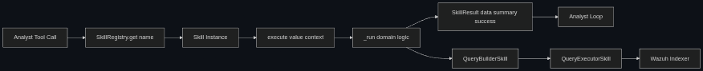

## Chapter 5. Implementation and Validation

### 5.1 Implementation Strategy

The implementation strategy adopted in this thesis followed an incremental approach. Rather than building the full SOC agent stack in a single phase, the system was constructed through steps, each introducing one capability and one clear interface. This strategy was selected to reduce integration complexity and preserve architectural explainability.

Development was managed as a sequence of controlled integration windows rather than parallel feature bursts. Each window ended with interface checks, regression tests, and a short architectural review to verify that new behavior did not violate previously defined boundaries (for example, analysis skills bypassing foundational query services, or memory logic leaking into analyst-stage decision paths). This discipline slowed early delivery but prevented structural debt accumulation in later stages.

In practical terms, each increment was validated before the next layer was added. Foundational components were implemented first, then source-specific analysis skills, then the three-agent reasoning pipeline, and finally the self-improvement layer with memory and reflection policy.

A second strategic decision concerned dependency flow. Dependencies were injected explicitly into skills and agents at initialization time instead of being resolved dynamically during execution. This made runtime behavior more predictable and kept each component testable in isolation. It also enabled clear startup wiring, where orchestration code explicitly describes which collaborators are used by each skill and stage.

Another important development choice was to treat prompt logic and software logic as separate layers. Prompt iterations were allowed to improve analytical quality, but only inside bounded agent responsibilities. Any change that modified control flow, schema shape, or persistence policy had to be implemented in code, not hidden inside prompt wording. This separation reduced fragile coupling between model behavior and system guarantees.

The main principle was always to privilege deterministic control flow around the model behavior. The language model was used for reasoning, planning, and synthesis, but execution interfaces, state transitions, and output schemas remained explicit and enforced. This balance allowed the implementation to benefit from model flexibility without sacrificing reproducibility and operational control.

### 5.2 Core Component Realization

#### 5.2.1 Foundational Query Services

The foundational layer was implemented as a strict query construction and execution flow. Query templates are thought as reusable primitives and instantiated through deterministic parameter substitution. Query execution is handled by a dedicated service that validates payload structure and communicates with Wazuh Indexer through a thin client abstraction.

Query syntax, transport behavior, and analytical logic were kept in different components, which reduced coupling and simplified troubleshooting. When behavior diverged from expectations, root-cause analysis could be localized to a specific layer instead of requiring end-to-end prompt debugging.

The parser component complemented this layer by normalizing responses before they reached LLM stages. Sparse or redundant payload fragments were removed to reduce token overhead and improve the signal-to-noise ratio of evidence passed to analytical agents.

#### 5.2.2 Decoder-Specific Analysis Skills

Analysis enrichment was implemented through decoder-specific skill families, with one skill set per source semantic domain. This design was chosen because equivalent observables are often represented under different field paths across log sources. A generic skill could issue syntactically valid queries that are semantically wrong for a given decoder, yielding silent false negatives.

The implemented skills for the Windows eventchannel source demonstrate this strategy. Specialized skills were created for IP, username, and rule-focused analysis, each with source-aware templates and aggregation logic. This approach increased upfront implementation effort, but it significantly improved interpretability and reduced ambiguity during investigation.

To support this model, shared helper functions were implemented for common aggregation processing tasks such as temporal histogram parsing, top-term extraction, and activity-profile summarization. This preserved consistency across specialized skills while avoiding repetitive code.

#### 5.2.3 Multi-Agent Pipeline Realization

The reasoning pipeline was realized as staged agents with separated responsibilities: Analyst, Evaluator, and Formatter, followed by an optional Reflector stage. The Analyst performs evidence collection through tool use, the Evaluator performs verdict reasoning without direct tool access, and the Formatter emits a fixed-schema report through constrained tool invocation.

A key implementation outcome was schema stability. Structured output generation was enforced through a single report tool contract rather than free-form prompting. This reduced formatting drift and ensured that downstream processing can rely on stable fields across runs.

During implementation, this staged decomposition also enabled controlled prompt and policy tuning. Analyst prompts were tuned for investigative breadth, evaluator prompts for adversarial interpretation balance, and formatter prompts for schema compliance. Because these concerns were separated by stage, tuning one objective did not repeatedly destabilize the others, which is a common failure mode in single-agent SOC prototypes.

#### 5.2.4 Knowledge Memory and Reflection Layer

The self-improvement layer was implemented using a vector-backed query store and two generic skills: one for retrieval of semantically relevant prior queries and one for generation of novel queries when retrieval is insufficient. Both skills are globally available as generic tools, while persistence decisions are delegated to a dedicated reflector agent.

A strict policy boundary was maintained between query generation and query promotion. Retrieval and crafting skills produce candidate actions and execution outcomes, but the reflector decides whether counters should be updated or new artifacts should be persisted. This policy separation prevented implicit memory growth and kept long-term adaptation behavior transparent.

The resulting memory mechanism supports compounding utility: successful query patterns become reusable operational assets, while low-value or weakly supported artifacts are filtered out by verdict-aware gating.

From a development standpoint, this layer required strict invariants to avoid uncontrolled growth of low-quality memory. The key invariant was: retrieval and crafting can suggest, but only reflection can persist. Enforcing this invariant in code, instead of in natural-language prompt instructions, was essential to keep long-term behavior auditable and predictable.

#### 5.2.5 What a Skill Is and What It Does

A skill is the execution unit used by the analyst during evidence collection. At code level, a skill is not a generic prompt instruction: it is a concrete Python class that subclasses the `Skill` abstract base class and returns a typed `SkillResult` object.

Every skill must declare three mandatory class attributes:
1. `name`: unique identifier used by the registry and by the analyst tool map.
2. `description`: operational description shown to the analyst model during tool selection.
3. `input_type`: observable category (`ip_address`, `username`, `rule_id`, `event_id`, or `meta` for generic skills).

The core logic lives in `_run(value, context)`, but runtime execution is always performed through `execute(value, context)`. This distinction is central to the architecture. The `execute` wrapper adds behavior that each skill should not reimplement independently:
1. wall-clock timing (`duration_ms`),
2. source tagging (`source` with the class name),
3. top-level exception handling that converts uncaught errors into a failed `SkillResult`.

As a consequence, all skills share a uniform output envelope:
1. `data`: JSON-serialisable payload,
2. `summary`: short analyst-facing textual synthesis,
3. `success`: explicit execution outcome.

This uniformity is what allows heterogeneous skills to be orchestrated through the same tool-use loop without custom post-processing per skill.

From a lifecycle perspective, one skill invocation follows a deterministic path:
1. The analyst selects a tool by `name`.
2. The registry resolves the corresponding pre-built skill instance.
3. `execute()` is called with an observable `value` and shared `context`.
4. `_run()` performs domain logic (query building/execution/aggregation parsing).
5. A normalized `SkillResult` is returned to the analyst loop.

A concrete example is `WindowsIPLookupSkill`. During initialization it registers its query template in the template store. During execution it:
1. builds a decoder-specific DSL query through `QueryBuilderSkill`,
2. runs the query through `QueryExecutorSkill`,
3. parses aggregation outputs (histogram, top rules, top users, destination IPs/ports),
4. returns a structured summary and data payload.

This design gives a clear separation between analytical intent (inside `_run`) and execution safety/observability (inside `execute`). 

### 5.3 Enrichment Workflow from Alert to Report

At runtime, the workflow starts from a Wazuh alert and optional contextual prompt and proceeds through evidence enrichment, assessment, and reporting. The Analyst stage interprets alert context, selects compatible tools, and iteratively gathers data until sufficient context is reached or execution limits are met.

Evidence acquisition follows the layered query path, which ensures uniform handling regardless of whether the query originated from a static template, vector retrieval, or on-demand query crafting. This unification simplified implementation and reduced the risk of behavioral drift between foundational and advanced skill paths.

After evidence gathering, the Evaluator produces a structured judgement that explicitly accounts for uncertainty through confidence signaling. The Formatter then generates a normalized incident report that preserves the analytical and evaluative artifacts. If enabled, the Reflector updates memory counters and promote new queries using verdict-aware policy.

This end-to-end flow was designed to preserve traceability at every step. The implementation therefore supports both operational usage and later metric extraction, since each run can be reconstructed from stage outputs and structured logs.

### 5.4 Problems Encountered and Solutions Applied

#### 5.4.1 Schema Heterogeneity and Silent False Negatives

One major challenge was telemetry schema heterogeneity across decoders. Early experimentation confirmed that field mismatches can produce empty results with no explicit failure signal. This creates a dangerous ambiguity in SOC analysis, where "no results" may reflect either benign absence or incorrect query semantics.

The challenge was addressed by enforcing decoder-specific skills and explicit absent-field semantics. The resulting implementation increases development effort but eliminates a critical class of silent analytical errors.

#### 5.4.2 Dependency Wiring and Runtime Stability

Another challenge concerned reliable component composition. Because skills require different collaborators (builder, executor, memory store, model client), class-based registration created unnecessary construction ambiguity.

This was resolved by moving to instance-based registry wiring with constructor injection. Startup configuration became explicit, and runtime behavior became more predictable. The same choice also improved testability by enabling straightforward replacement of collaborators with controlled doubles.

#### 5.4.3 Structured Output Reliability

A recurring risk in LLM systems is output-shape instability. Free-form generation can be linguistically convincing but structurally inconsistent, which is problematic for downstream processing and empirical comparison.

This issue was mitigated through enforced schema emission in the Formatter stage. By constraining report generation to a single tool contract, implementation stability improved and integration with evaluation workflows became significantly easier.

#### 5.4.4 Safe Query Innovation

Introducing novel-query generation created a reliability challenge: newly generated DSL can be syntactically invalid or operationally unfit. If persisted without control, such artifacts degrade knowledge quality over time.

This challenge was handled through bounded validation attempts and policy-gated promotion. Query generation remains flexible, but memory persistence is conservative and evidence-aware. This balance preserved innovation capacity without sacrificing long-term store quality.

#### 5.4.5 Observability and Reproducibility

As the pipeline gained complexity, ad hoc logging proved insufficient for reproducible analysis. Without consistent run-level identifiers and event taxonomy, tracing behavior across stages became inefficient.

The solution was structured JSON logging with per-run identifiers and stable event classes. This enabled run reconstruction, simplified troubleshooting, and prepared the system for metric-driven evaluation without redesigning core logic.

#### 5.4.6 Tool-Loop Saturation and Runaway Iterations

An additional challenge emerged in the analyst tool-use loop: without strict loop governance, the model could over-call tools and consume tokens without improving evidentiary quality. This created two risks: unnecessary latency and investigation drift.

The issue was mitigated by introducing bounded iteration control and explicit stopping behavior. A fixed iteration cap was enforced, and empty or low-value tool responses were treated as terminal evidence rather than automatic retry conditions. This reduced runaway execution patterns and stabilized runtime cost.

#### 5.4.7 Chroma Metadata Constraints and Serialization Friction

The memory layer introduced a practical data-model challenge: Chroma metadata fields accept scalar-friendly structures, while query artifacts naturally include list-based parameters and richer nested context. Early attempts to store metadata naively produced inconsistent behavior and reduced retrieval reliability.

This was solved by defining a normalized persistence schema and explicit serialization rules at the store boundary. Parameters were normalized into a stable string representation for metadata storage, while semantic text remained in document content. This separation preserved retrieval quality and prevented backend-format quirks from leaking into higher-level agent logic.

### 5.6 Chapter Summary

This chapter described how the SOC L1 agent was implemented through an incremental, interface-first strategy designed to control complexity and preserve explainability. It detailed the realization of foundational query services, decoder-aware enrichment skills, staged agent orchestration, and policy-governed memory adaptation.

It also documented the principal challenges that were successfully addressed, including schema mismatch risk, dependency wiring, structured output stability, safe query innovation, observability, loop saturation control, mutable state hygiene, and vector-store serialization constraints. The resulting implementation establishes a stable foundation for the evaluation chapter, where analytical effectiveness and operational tradeoffs can be measured systematically.
